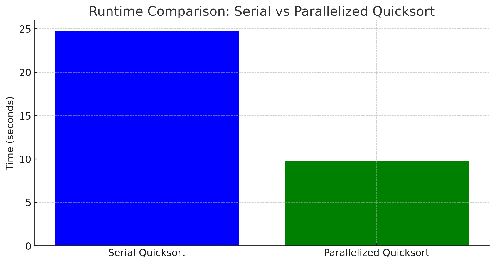

# AUTOPAR

A program that performs automatic task parallelization of function calls of C/C++ code with OOP support. Is essentially a parallelized code generator given serial/sequential input. 

# Task-Based Parallelization

## Task Creation

### Task Groups

Encapsulate function bodies into OpenMP taskgroups given the following conditions:

- the function has a function call
- that function call is defined by the user

### Tasks

Encapsulate function calls into OpenMP tasks given that the function being called is defined by the user.
Ignoring dependencies for now, I will cover that in the next subsection.

In 1(a) and 1(b) we have an example of a simple function call to some function foo with either no return value or an ignored return value.

#### 1(a) function call with no return value

```C++
foo(a, b);
```

#### 1(b) transformed function call

```C++
#pragma omp task
{
foo(a, b);
}
```

In 2(a) and 2(b) an example of a function call with a return value. I chose to split the definition and declaration into two different steps so the variable is accessible outside of the task scope. And, if the variable is const-qualified, the program removes the const qualifier. Clearly, if the statement contains only an assignment, then just encapsulate the assignment.

#### 2(a) function call with return value

```C++
const int x = foo(a, b);
```

#### 2(b) transformed function call

```C++
int x;
#pragma omp task
{
x = foo(a, b);
}
```

## Dependency Analysis

In an OpenMP task, the depend clause is used to explicitly specify the data dependency of task. To determine these dependencies, I categorized variables in the function call as either reading or writing to memory based off of their respective type in the callee definition. Read variables are those that are const or passed by value. Write variables are non-constant pointers or references. In the depend clause read variables are listed as "in", and write variables as "inout".

Since I use the depend clause, I rely on the OpenMP runtime to evaluate and run tasks in the correct order, as opposed to building a dependency graph and restructuring the code as I did in my previous attempt.

There are some cases where this will not work.

variables in array indices.
statements that use the write variables of tasks
To handle these cases, I chose to explicitly create a barrier with the OpenMP taskwait directive. This has the cost of limiting the degree of parallelism, but maintains strict dependency correctness. It is necessary because within a taskgroup, the OpenMP runtime will execute seemingly unrelated tasks in an arbitrary order.

In 3(b), we see the dependencies expressed in the transformed function call of 3(a), and observe that the increment to z has a taskwait to assert that the task(s) above are completed before executing the next statements.

#### 3(a) function definition alongside function call and statement

```C++
void foo(int a, const int *b, int &c) {
	...
}
...
foo(x, y, z);
z += 1;
```

#### 3(b) transformed function call and explicit barrier

```C++
void foo(int a, const int *b, int &c) {
	...
}
...
#pragma omp task depend(in: x, y) depend(inout: z)
{
foo(x, y, z);
}
#pragma omp taskwait
z += 1;
```

### Return Management

An interesting case in dependency analysis is the management of the return and when to exit out of a function. OpenMP does not support returning from a task or taskgroup, so the program must remove all return statements. I chose for the program to replace the return statements with a jump to a label at the end of the taskgroup. The replacement maintains program correctness since we will not execute code post-return, and it also has the beneficial side effect of handling the state of memory. OpenMP taskgroups have an implicit taskwait barrier; the runtime will only exit out of a taskgroup when it has completed all tasks. Since the runtime will have completed all tasks, we are assured of having the correct values in memory and can safely exit the function. This solution requires creating the label at the end of the taskgroup and a temporary variable to assign the return value, then returning at the end of the taskgroup (which is the function). In the case of void functions, we have the same label and jump but without the temporary variable.

In 4(a) we define a function with multiple returns, and in 4(b) observe the source code transformation. Pre taskgroup, we define the AUTOPAR_res variable. Post taskgroup, we return AUTOPAR_res. We add the empty label AUTOPAR_endtaskgrouplabel_function_with_multiple_returns. Finally, we replace all returns with barrier, assign and goto statements.

#### 4(a) function definition

```C++
int foo(int &a, int &b) {
...
	if (a > b) {
		int c;
		...
		return c;
	} else {
		int d;
		...
		return d;
	}
}
```

#### 4(b) transformed function definition

```C++
int foo(int &a, int &b) {
	int AUTOPAR_res;
	#pragma omp taskgroup
	{
	...
	if (a > b) {
		int c;
		...
		AUTOPAR_res = c;
		goto AUTOPAR_endtaskgrouplabel_f;
	} else {
		int d;
		...
		AUTOPAR_res = d;
		goto AUTOPAR_endtaskgrouplabel_f;
	}

	AUTOPAR_endtaskgrouplabel_f: ;
	}

	return AUTOPAR_res;
}
```

## Limiting the Number of Tasks

In the program's transformed files, each function and member function is encapsulated inside a taskgroup, and creates a task for each call. Each task created causes overhead, so I implemented a way to limit tasks. At first, I only implemented a strategy of limiting the total number of tasks. However, to support recursion, I added the second strategy of limiting the task depth. I did not have the time to support controlling task granularity. For example, I could have omitted task creation for small tasks.

### Maximum Number of Tasks

Limit the total number of tasks by adding to a global counter when a task is created, and subtracting when that task is finished. If the number of tasks exceeds the predetermined limit, stop creating tasks until the counter is decremented to below the limit.

### Maximum Task Depth

Limit the task depth by passing a counter variable between tasks and taskgroups.

Add a global threadprivate variable named nbdepth at the beginning of each program. Since each task is a new thread we define the variable as threadprivate so each thread (task) has its own depth count. Initialize nbdepth to 0.

In each taskgroup, the current thread creates a local variable, local_nbdepth, holding a copy of the threadprivate nbdepth. Then, pass in the local_nbdepth as firstprivate in the task pragma to maintain thread privacy, and to initialize with the value from before the parallel region.

Within the parallel region of a task created by the thread, we want to increment separate counts for each task branch. So, if the parallel region creates a task, set nbdepth to local_nbdepth + 1, then spawn the new child task and use that nbdepth in the potential taskgroup created by the child.

# Results 

### Test Cases
* Quicksort: A program sorts an array of 100 million randonly generated integers, with a test after to validate the sort.
* Molecular-Dyn: A program simulates 100 iterations of interactions between 10000 particles with a grid distribution of dimension 5^3

### Hardware 
11th Gen Intel(R) Core(TM) i7-1165G7 @ 2.80GHz

### Results
Time is average runtime per 10 runs, timed using the Linux `time` command.

#### Quicksort Runtime Comparison
We observe an average speedup of 2.51 with AUTOPAR.


#### Molecular Dynamics Runtime Comparison
We observe an average speedup of 2.22 with AUTOPAR.


# Dependencies
- OpenMP
- LLVM-18 and Clang-18
- CMake >= 3.29

# Building and Running
```Bash
# Build the CMake way (from project root):
mkdir build/ && cd build
cmake ..
make
# then run from the build directory:
./autopar <list of serial code files>
# or make install and run from /usr/local/bin (assuming it's in PATH):
make install
autopar <list of serial code files>
```
